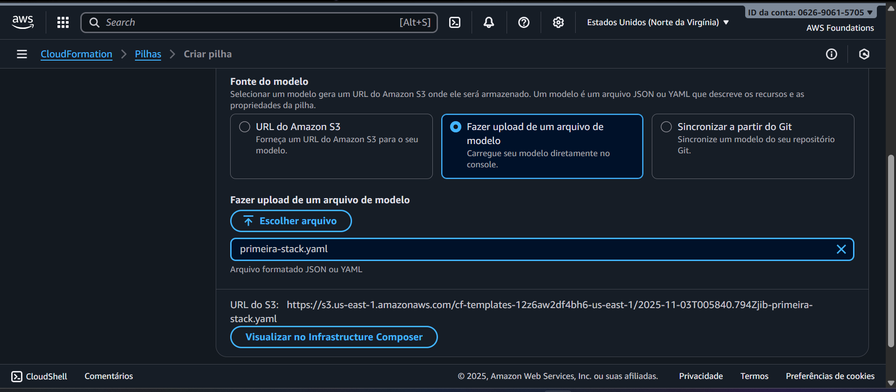
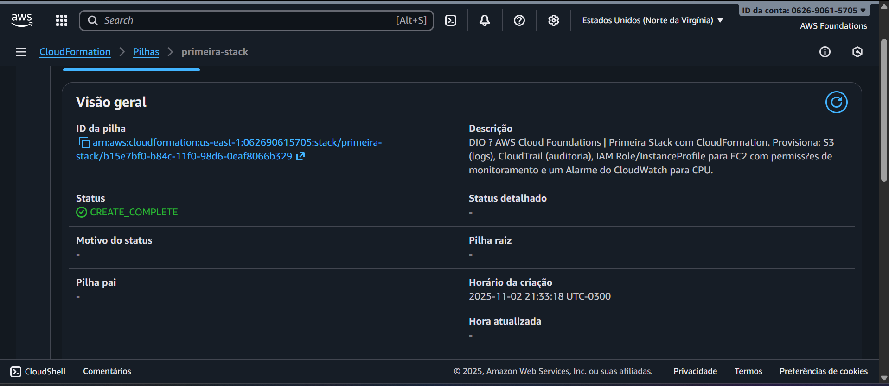
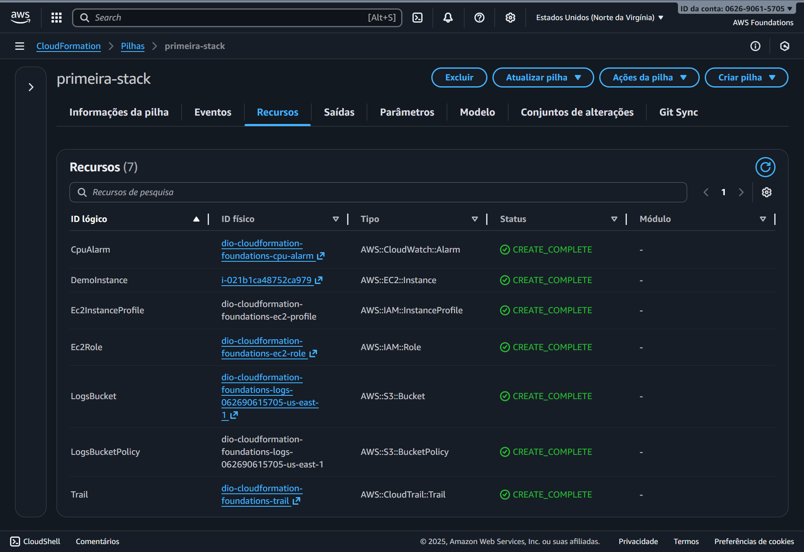
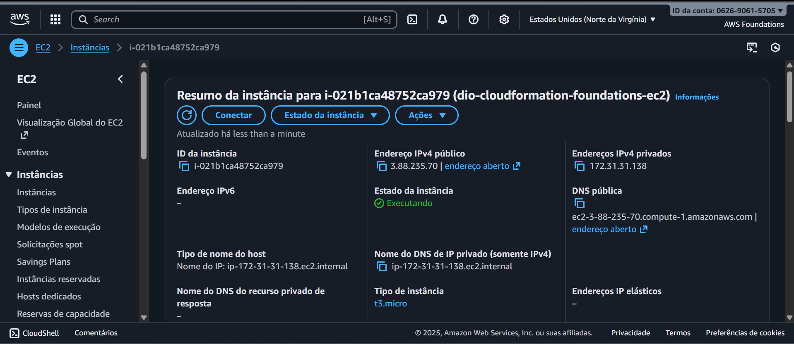
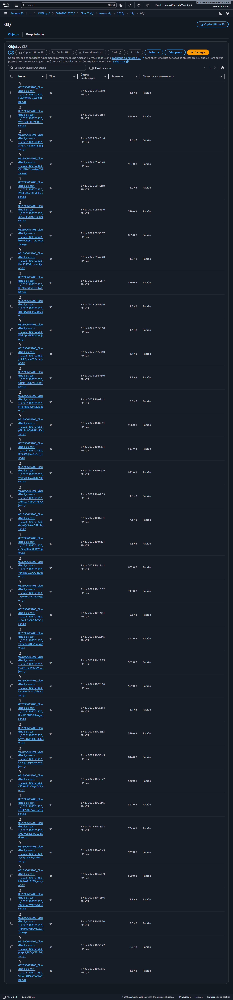

# ☁️ Desafio AWS CloudFormation Foundations – DIO

> 📘 **Atualização:**  
> Este repositório também atende ao desafio **“Infraestrutura Automatizada com AWS CloudFormation”** da formação *AWS Cloud Foundations – DIO & Santander Code Girls*.  
> O projeto demonstra a aplicação prática de **Infraestrutura como Código (IaC)**, utilizando **templates YAML** para criação automatizada e segura de recursos AWS, como S3, CloudTrail, IAM, EC2 e CloudWatch.  
> Além de cumprir os requisitos de automação, padronização e segurança, este projeto reforça as boas práticas de documentação técnica e versionamento com GitHub.


## 📘 Visão Geral

Este projeto foi desenvolvido como parte da formação **AWS Cloud Foundations – Santander Code Girls (DIO)**.  
O objetivo é demonstrar a criação e automação de uma infraestrutura em nuvem utilizando o serviço **AWS CloudFormation**, aplicando o conceito de **Infraestrutura como Código (IaC)**.

O desafio consistiu em criar um **template YAML** capaz de provisionar automaticamente múltiplos serviços AWS integrados, sem a necessidade de configuração manual pelo console.

## 🎯 Objetivos de Aprendizagem

- Aplicar os conceitos aprendidos em um ambiente prático de nuvem.  
- Documentar processos técnicos de forma clara e estruturada.  
- Utilizar o GitHub como ferramenta de versionamento e compartilhamento técnico.  
- Consolidar boas práticas de automação, segurança e padronização de infraestrutura.


---

## 🧠 Conceito de CloudFormation

O **AWS CloudFormation** é um serviço que permite descrever toda a infraestrutura da nuvem através de **arquivos declarativos**.  
Com ele, é possível criar, atualizar e excluir recursos de forma automatizada e reprodutível, garantindo que diferentes ambientes (como desenvolvimento e produção) tenham a mesma estrutura e configuração.

Essa abordagem é parte fundamental do modelo **DevOps** e do princípio de **automação completa** da infraestrutura.

---

## 🧩 Estrutura do Projeto

```
📁 desafio-aws-cloudformation-foundations/
│
├── 📄 README.md → Documentação técnica e detalhada
├── anotacoes.md → Anotações e insights sobre os desafios
├── 📁 templates/
│ └── primeira-stack.yaml → Template principal em YAML
└── 📁 images/ → Evidências do processo de execução
├── template-upload.png
├── stack-create-complete.png
├── resources-list.png
├── ec2-running.png
├── cloudwatch-alarm.png
└── cloudtrail-logs.png
```


---

## ⚙️ Arquitetura Criada

O template `primeira-stack.yaml` foi desenvolvido para automatizar a criação dos seguintes componentes na AWS:

| Recurso | Serviço AWS | Descrição |
|----------|--------------|------------|
| **S3 Bucket (LogsBucket)** | Amazon S3 | Armazena logs de auditoria e eventos. |
| **Bucket Policy** | S3 Policy | Permite que o CloudTrail grave logs dentro do bucket. |
| **CloudTrail (Trail)** | AWS CloudTrail | Registra todas as ações realizadas na conta AWS. |
| **IAM Role e Instance Profile** | AWS Identity and Access Management | Concede permissões à instância EC2 para enviar métricas e logs ao CloudWatch. |
| **EC2 Instance (DemoInstance)** | Amazon EC2 | Instância criada automaticamente para simulação prática. |
| **CloudWatch Alarm (CpuAlarm)** | Amazon CloudWatch | Cria um alerta quando o uso de CPU da instância ultrapassa 70%. |

Esses recursos se complementam e demonstram como o CloudFormation pode orquestrar **infraestrutura completa**, englobando **armazenamento, segurança, auditoria e monitoramento** em um único arquivo YAML.

---

## 🧱 Estrutura do Template (Explicação Detalhada)

### 🔹 Cabeçalho e Descrição

```yaml
AWSTemplateFormatVersion: '2010-09-09'
Description: >
  DIO – AWS Cloud Foundations | Primeira Stack com CloudFormation.
  Provisiona: S3 (logs), CloudTrail (auditoria), IAM Role/InstanceProfile para EC2
  e um Alarme do CloudWatch para CPU.
# Define a versão do formato CloudFormation e a descrição geral da pilha, explicando o propósito do projeto.
```
### 🔹 Parâmetros

```yaml
Parameters:
  ProjectName:
    Type: String
    Default: dio-cloudformation-foundations
  InstanceType:
    Type: String
    Default: t3.micro
# Permitem personalizar a stack ao criar, alterando nome do projeto ou tipo da instância EC2.

```
### 🔹 Criação do Bucket S3

```yaml
LogsBucket:
  Type: AWS::S3::Bucket
  Properties:
    BucketName: !Sub '${ProjectName}-logs-${AWS::AccountId}-${AWS::Region}'
# Cria um bucket S3 para armazenar logs com nome único, criptografia AES256 e bloqueio público.

```
### 🔹 Política de Acesso ao Bucket

```yaml
LogsBucketPolicy:
  Type: AWS::S3::BucketPolicy
  Properties:
    Bucket: !Ref LogsBucket
# Define permissões para o CloudTrail gravar arquivos no bucket.
# Garante que apenas o serviço autorizado possa escrever logs de auditoria.
```

### 🔹 Trilha de Auditoria (CloudTrail)

```yaml
Trail:
  Type: AWS::CloudTrail::Trail
  Properties:
    S3BucketName: !Ref LogsBucket
    IsLogging: true
# Cria uma trilha que registra eventos (login, criação, exclusões) e envia logs ao bucket S3.
```
### 🔹 IAM Role e Instance Profile

```yaml
Ec2Role:
  Type: AWS::IAM::Role
  Properties:
    AssumeRolePolicyDocument:
      Statement:
        - Effect: Allow
          Principal:
            Service: ec2.amazonaws.com
# Cria uma função IAM que permite à EC2 enviar métricas e logs ao CloudWatch.
```

### 🔹 Instância EC2

```yaml
DemoInstance:
  Type: AWS::EC2::Instance
  Properties:
    ImageId: !Ref LatestAmiId
    InstanceType: !Ref InstanceType
# Cria uma instância EC2 Amazon Linux 2023, principal recurso do ambiente.
```

### 🔹 Alarme de CPU

```yaml
CpuAlarm:
  Type: AWS::CloudWatch::Alarm
  Properties:
    MetricName: CPUUtilization
    Threshold: 70
# Cria um alarme que dispara se a CPU ultrapassar 70% em dois períodos consecutivos.
```

### 🔹 Saídas (Outputs)

```yaml
Outputs:
  oInstanceId:
    Description: ID da instância EC2 provisionada.
    Value: !Ref DemoInstance
# Exibe informações finais como ID da instância, nome do bucket e região.
# Úteis para automações e integrações entre stacks.

```

## 🧰 Como Reproduzir o Projeto

1. Faça login na AWS e acesse o serviço **CloudFormation**.  
2. Clique em **Create Stack → Upload a template file**.  
3. Selecione o arquivo `primeira-stack.yaml`.  
4. Clique em **Next → Next → Create stack**.  
5. Aguarde o status **CREATE_COMPLETE** e visualize os recursos provisionados.


## 🚀 Passos Executados

1. **Criação do arquivo `primeira-stack.yaml`**  
   Template desenvolvido e validado no VS Code, contendo todos os recursos descritos em YAML.

2. **Upload no AWS CloudFormation**  
   Feito diretamente pelo console AWS → *Create Stack → Upload a template file*.

3. **Validação e Execução**  
   Aguardado o status **`CREATE_COMPLETE`** indicando a criação bem-sucedida da stack.

4. **Verificação dos Recursos**  
   Confirmado o provisionamento automático de todos os serviços listados (S3, CloudTrail, IAM, EC2 e CloudWatch).

5. **Testes e Auditoria**  
   Acesso à instância **EC2** para confirmar o estado de execução e inspeção do **bucket S3** para verificar o recebimento dos logs do CloudTrail.

---

## 🖼️ Evidências da Implementação

| Etapa | Descrição | Imagem |
|-------|------------|--------|
| 1️⃣ | Upload do template YAML no CloudFormation |  |
| 2️⃣ | Stack criada com sucesso (CREATE_COMPLETE) |  |
| 3️⃣ | Recursos provisionados automaticamente |  |
| 4️⃣ | Instância EC2 em execução |  |
| 5️⃣ | Alarme CloudWatch criado automaticamente |  |
| 6️⃣ | Logs do CloudTrail armazenados no bucket S3 |  |


---

## 📊 Benefícios da IaC e CloudFormation

- 🚀 **Recriação rápida** de ambientes em minutos.  
- 🧩 **Eliminação de erros humanos** por meio de automação declarativa.  
- 🕓 **Versionamento e histórico** centralizados no GitHub.  
- 🏗️ **Padronização de ambientes** (Desenvolvimento, QA e Produção).  
- 🔄 **Integração com pipelines CI/CD** e controle de mudanças contínuas.

---

## 💡 Conclusões Pessoais

Durante o desenvolvimento deste desafio, foi possível compreender na prática:

- Como estruturar templates **CloudFormation** de forma modular e reutilizável.  
- A importância de **políticas seguras no IAM** e **bloqueio público no S3**.  
- A sinergia entre **CloudTrail, CloudWatch e EC2** para auditoria e monitoramento.  
- O valor da **automação e reprodutibilidade** em ambientes profissionais de nuvem.  

O projeto demonstrou que, com **um único arquivo YAML**, é possível criar uma infraestrutura completa, segura e documentada, aplicando boas práticas de **Infraestrutura como Código (IaC)**.

Este repositório consolida os aprendizados da formação **AWS Cloud Foundations**, sendo também a entrega oficial do desafio **“Infraestrutura Automatizada com AWS CloudFormation”**, que reforça a aplicação prática de automação, segurança e documentação profissional em ambiente AWS.


---

## 🔗 Documentações e Recursos

- [📘 AWS CloudFormation – Documentação Oficial](https://docs.aws.amazon.com/pt_br/AWSCloudFormation/latest/UserGuide/Welcome.html)  
- [📙 AWS CloudWatch – Alarms and Metrics](https://docs.aws.amazon.com/AmazonCloudWatch/latest/monitoring/AlarmThatSendsEmail.html)  
- [📗 AWS CloudTrail – Logging and Events](https://docs.aws.amazon.com/awscloudtrail/latest/userguide/cloudtrail-user-guide.html)  
- [📓 DIO – Formação AWS Cloud Foundations](https://www.dio.me)

---

## ✨ Autora

**Lorena Cardoso Sanches**  
Formação **AWS Cloud Foundations – DIO & Santander Code Girls**  
📍 São Bernardo do Campo – SP  
🔗 [linkedin.com/in/lorenacardososanches](https://www.linkedin.com/in/lorenacardososanches)
